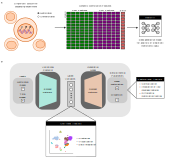

# methylVI

<p align="center">
    
</p>

methylVI is a generative model designed to facilitate analyses of single-cell methylomic
data generated from bisulfite sequencing platforms (e.g. snmC-seq, sciMET, etc.). methylVI
assumes that the measurements from individual cytosines have already been aggregated into
a cell by genomic region (e.g. gene bodies, promoter regions, etc.) matrix, and the model
accepts CpG and/or CpH methylation measurements as input.

## User guide

### Installation

To install the latest version of methylVI via pip

```
pip install methyl-vi
```

Installation should take no more than 5 minutes.

### What you can do with methylVI

* Embed high-dimensional methylation profiles into a lower-dimensional latent space.
* Produced denoised methylation profiles ([demo notebook](https://colab.research.google.com/drive/18Srw6PfAEbbe36tOjcP2XSca5OOxBFlS?usp=sharing)). 
* Integrate data collected in different experimental conditions (e.g. with different sequencing platforms, at different time points, etc.) ([demo notebook](https://colab.research.google.com/drive/1SO-b4z_7LFvcYMDRPBvvUUxwbtj77o32?usp=sharing)). 
* (Coming soon) Perform differentially methylated region testing.


### References

If you find methylVI useful for your work, please consider citing

```
@inproceedings{
    methylVI,
    title={A deep generative model of single-cell methylomic data},
    author={Ethan Weinberger and Su-In Lee},
    booktitle={NeurIPS 2023 Generative AI and Biology (GenBio) Workshop},
    year={2023},
    url={https://openreview.net/forum?id=Mg2DM0F3AY}
}
```
